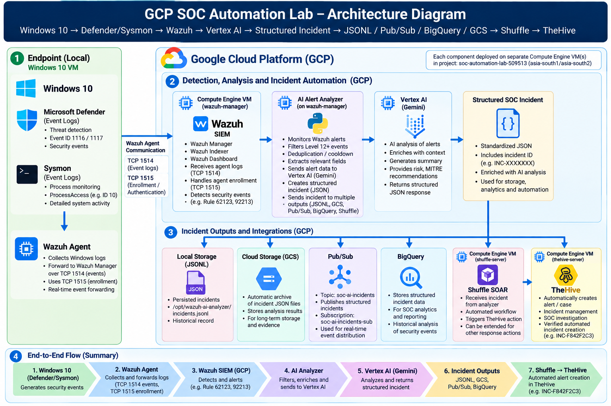

# GCP SOC Automation Lab

> Cloud-based SOC automation lab integrating Wazuh SIEM, Microsoft Defender, Sysmon, Google Cloud Vertex AI, Shuffle SOAR, TheHive, Pub/Sub, BigQuery, and Cloud Storage.

## Overview

This project demonstrates an end-to-end Security Operations Center (SOC) workflow deployed across Google Cloud Platform and a monitored Windows endpoint.

Security telemetry generated by Microsoft Defender and Sysmon is collected by the Wazuh agent and forwarded to the Wazuh Manager running on Google Cloud.

High-severity Wazuh alerts are processed by a custom Python AI analyzer that uses Google Cloud Vertex AI to generate structured SOC investigation results including a verdict, risk level, confidence, evidence, investigation steps, and recommended action.

The resulting incident is then automatically:

- Persisted locally in JSONL format.
- Archived in Google Cloud Storage.
- Stored in BigQuery for historical analysis.
- Published to Pub/Sub.
- Sent to Shuffle SOAR for workflow automation.
- Forwarded to TheHive for centralized alert and incident management.

The project demonstrates how SIEM, AI-assisted analysis, cloud services, SOAR, and incident response platforms can be integrated into a single automated SOC pipeline.

## Architecture



### End-to-End Workflow

**Windows Endpoint → Microsoft Defender / Sysmon → Wazuh → Vertex AI → Structured SOC Incident → JSONL + Cloud Storage + BigQuery + Pub/Sub + Shuffle → TheHive**

## Technology Stack

| Layer | Technology | Purpose |
|---|---|---|
| Endpoint | Windows 10 | Monitored endpoint |
| Endpoint Security | Microsoft Defender | Malware and threat detection |
| Telemetry | Sysmon | Detailed Windows process and security telemetry |
| SIEM | Wazuh | Log collection, detection, and alert generation |
| Cloud Platform | Google Cloud Platform | Cloud infrastructure and managed services |
| AI Analysis | Vertex AI (Gemini) | AI-assisted security alert investigation |
| Automation | Python | Custom alert analysis and incident processing |
| SOAR | Shuffle | Automated incident workflow orchestration |
| Incident Management | TheHive | Alert and incident management |
| Messaging | Pub/Sub | Event-driven incident distribution |
| Analytics | BigQuery | Structured historical SOC analytics |
| Archive | Cloud Storage | Cloud-based incident archival |

## How the Automation Works

### 1. Security Telemetry Collection

Microsoft Defender and Sysmon generate security telemetry on the Windows endpoint. The Wazuh agent collects the configured Windows event channels and forwards the events to the Wazuh Manager.

### 2. SIEM Detection

Wazuh analyzes the incoming telemetry and generates security alerts using its detection rules.

The AI pipeline processes qualifying high-severity alerts while applying event-specific deduplication, cooldown handling, and known-noise suppression.

### 3. AI-Assisted Alert Analysis

The custom Python analyzer enriches the Wazuh alert context and submits it to Google Cloud Vertex AI.

Vertex AI returns a structured investigation result containing fields such as:

- Verdict
- Risk
- Confidence
- Alert summary
- Evidence
- Investigation steps
- Recommended action

The response is validated and converted into a standardized SOC incident with a unique incident ID.

### 4. Cloud Persistence and Distribution

The structured incident is automatically distributed to multiple destinations:

- **JSONL** for local persistence.
- **Cloud Storage** for durable incident archival.
- **BigQuery** for historical analysis.
- **Pub/Sub** for event-driven distribution.

### 5. SOAR Automation

The analyzer sends the structured incident to a Shuffle webhook.

Shuffle executes the configured workflow and dynamically maps the incident data into a TheHive alert.

### 6. Incident Management

TheHive receives the automated alert containing the relevant Wazuh and AI-analysis context, allowing the incident to continue into a centralized investigation workflow without requiring manual alert creation.

## Testing and Validation

The project was validated progressively from endpoint detection through final incident creation.

Key validation scenarios included:

- EICAR test detection by Microsoft Defender.
- Defender security events forwarded to Wazuh.
- High-severity Wazuh alerts processed by the AI analyzer.
- Vertex AI structured alert analysis.
- Unique SOC incident generation and JSON validation.
- Local JSONL incident persistence.
- Automatic Cloud Storage archival.
- BigQuery incident insertion.
- Pub/Sub incident publishing.
- Shuffle webhook ingestion and workflow execution.
- Automatic TheHive alert creation.

The final end-to-end test confirmed that a security event generated on the Windows endpoint could travel through the complete SOC pipeline and result in an automatically created incident in TheHive.

For detailed testing information, see [Testing and Validation](Testing/README.md).

## Project Evidence

The repository contains **43 implementation and validation screenshots** documenting the project from initial GCP deployment through final end-to-end automation.

The evidence includes deployment, configuration, troubleshooting, detection, AI analysis, cloud integration, SOAR automation, and final incident creation.

See the complete [Evidence Documentation](Evidence/README.md).

## Repository Structure

```text
GCP-SOC-Automation-Lab/
├── Architecture/
│   ├── README.md
│   └── gcp-soc-automation-architecture.png
├── Configs/
│   ├── README.md
│   ├── wazuh/
│   ├── ai-analyzer/
│   └── automation/
├── Evidence/
│   ├── README.md
│   └── 01-... through 43-...
├── GCP/
│   └── README.md
├── Testing/
│   └── README.md
├── .gitignore
├── LICENSE
└── README.md

```
## Security Considerations

This repository contains only sanitized examples intended to demonstrate the architecture and implementation of the lab.

Sensitive information such as credentials, API keys, passwords, authentication tokens, webhook identifiers, and public infrastructure addresses has been removed or replaced with placeholders.

Original lab configuration files containing sensitive values are intentionally excluded from the repository.

The published configuration examples should be reviewed and adapted before use in another environment.

## Key Outcomes

This project demonstrates practical experience with:

- Deploying and operating a cloud-hosted SIEM environment.
- Collecting Microsoft Defender and Sysmon security telemetry.
- Investigating and processing Wazuh security alerts.
- Building a custom Python-based AI alert-analysis pipeline.
- Integrating Google Cloud Vertex AI with SOC workflows.
- Implementing alert filtering, deduplication, and noise suppression.
- Creating standardized security incident objects.
- Persisting security incidents in JSONL, Cloud Storage, and BigQuery.
- Publishing security incidents through Pub/Sub.
- Automating incident workflows with Shuffle SOAR.
- Integrating automated alerts with TheHive.
- Testing and validating an end-to-end SOC automation workflow.
- Documenting and sanitizing a security project for public GitHub publication.

## Disclaimer

This project was created as a cybersecurity lab and portfolio project for educational and defensive security purposes.

The EICAR antivirus test file was used only as a safe method of generating antivirus detections. No real malware, production credentials, or confidential organizational data is included in this repository.

---

## Project Documentation

For detailed implementation information, explore:

- [Architecture](Architecture/README.md)
- [Configuration Examples](Configs/README.md)
- [Google Cloud Integration](GCP/README.md)
- [Testing and Validation](Testing/README.md)
- [Implementation Evidence](Evidence/README.md)
